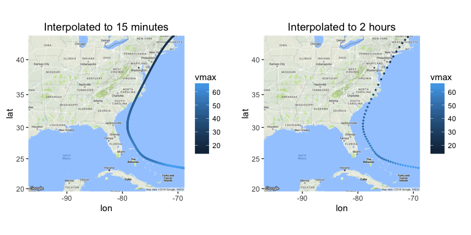
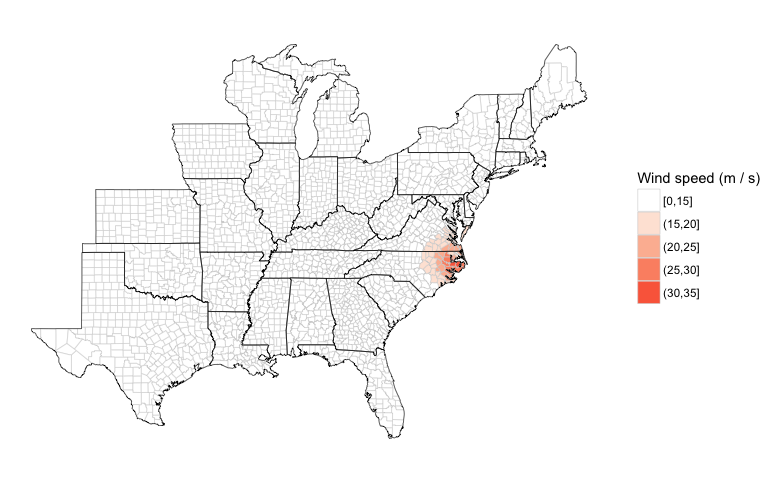
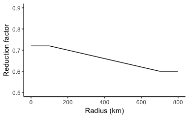
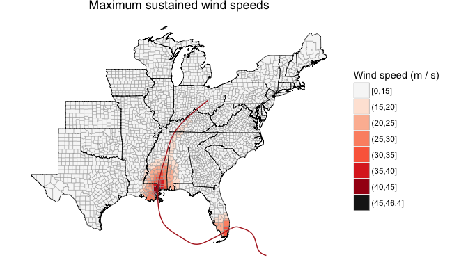
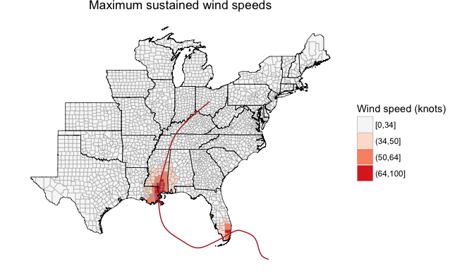
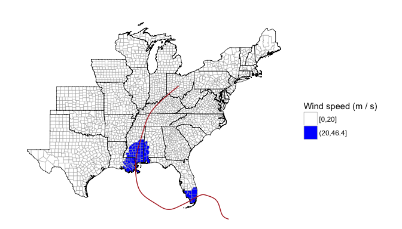
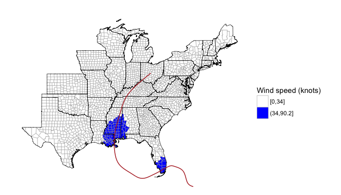
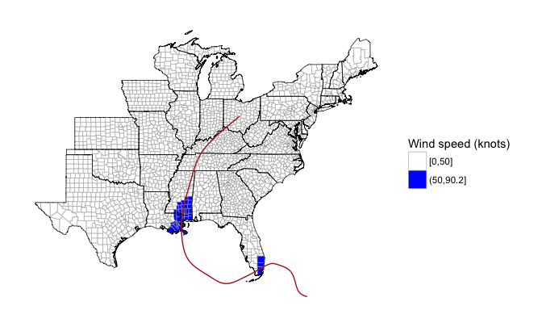
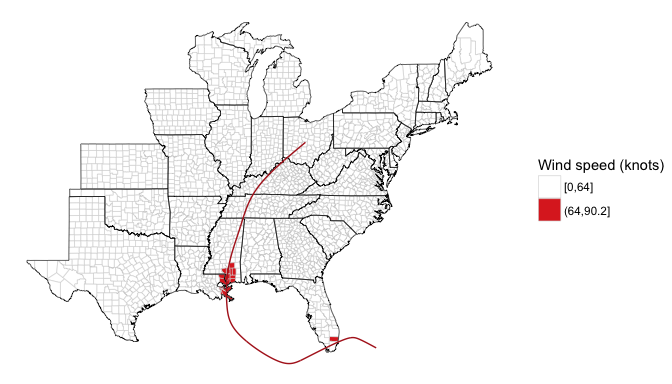

Overview of wind modeling process
---------------------------------

Here is an overview of the wind modeling process implemented by this package:

1.  Impute location and maximum wind speed from hurricane track data (every 6 hours) to more frequent intervals. The default is to impute to every 15 minutes.
2.  For each storm track location, calculate all the inputs needed for the Willoughby wind speed model (forward speed, direction of forward motion of the storm, gradient-level wind speed, radius of maximum winds, parameters for decay of winds away from the storm's center for Willoughby model) (Willoughby, Darling, and Rahn 2006).
3.  For each county center (or other grid point), estimate surface-level sustained wind and 3-second wind gusts at all storm observation points (i.e., all points along the interpolated storm track). This step includes: measuring distance to county from storm center (radius); calculating tangential gradient wind components at that grid point; calculating gradient wind direction at that grid point; calculating surface wind speed; calculating surface wind direction, adding storm forward motion back into surface wind estimate.
4.  Determine for each county: the maximum sustained winds and wind gust speeds at any point on the storm's track; the duration of sustained and gust winds over a certain speed (i.e., how many minutes winds were above a cutoff).

This process is conducted in the `stormwindmodel` package using three main functions: `create_full_track`, `add_wind_radii`, and `calc_grid_wind`. Each of these functions has a number of helper functions to do each required modeling step. Details of all of these are included in this vignette. The full process is then wrapped in the `get_grid_winds` function, which is the main function most people will use from this package.

Variable definitions
--------------------

Here are variables used in this modeling process.

| R variable         | Expression in equations                 | Definition                                                                                                               | Units                  |
|:-------------------|:----------------------------------------|:-------------------------------------------------------------------------------------------------------------------------|:-----------------------|
| `vmax`             | *V*<sub>*m**a**x*</sub>                 | Maximum 10-m 1-min sustained wind for the tropical cyclone                                                               | m/s                    |
| `vmax_sfc_sym`     | *V*<sub>*m**a**x*, *s**y**m*</sub>      | Maximum 10-m 1-min sustained wind for the tropical cyclone with motion asymmetry removed                                 | m/s                    |
| `vmax_gl`          | *V*<sub>*m**a**x*, *G*</sub>            | Maximum gradient-level 1-min sustained wind for the tropical cyclone                                                     | m/s                    |
| `tclat`            | *ϕ*                                     | Tropical cyclone center position latitude                                                                                | degrees North          |
| `tclon`            | *L*                                     | Tropical cyclone center position longitude (0 to 360)                                                                    | degrees East           |
| `Rearth`           | *R*<sub>*e**a**r**t**h*</sub>           | Radius of the earth                                                                                                      | km                     |
| `tcspd`            | *F*                                     | Tropical cyclone forward speed                                                                                           | m/s                    |
| `tcspd_u`          | *F*<sub>*u*</sub>                       | Tropical cyclone forward speed, u-component                                                                              | m/s                    |
| `tcspd_v`          | *F*<sub>*v*</sub>                       | Tropical cyclone forward speed, v-component                                                                              | m/s                    |
| `tcdir`            | *θ*<sub>*F*</sub>                       | Tropical cyclone forward direction                                                                                       | degrees (trigonomical) |
| `X1`               | *X*<sub>1</sub>                         | Parameter for Willoughby model                                                                                           | --                     |
| `X2`               | *X*<sub>2</sub>                         | Parameter for Willoughby model                                                                                           | --                     |
| `n`                | *n*                                     | Parameter for Willoughby model                                                                                           | --                     |
| `A`                | *A*                                     | Parameter for Willoughby model                                                                                           | --                     |
| `xi`               | *ξ*                                     | Parameter for Willoughby model                                                                                           | --                     |
| `R1`               | *R*<sub>1</sub>                         | Lower boundary of the transition zone for Willoughby model                                                               | km                     |
| `R2`               | *R*<sub>2</sub>                         | Upper boundary of the transition zone for Willoughby model                                                               | km                     |
| `gwd`              | *θ*<sub>*G*</sub>                       | Gradient wind direction                                                                                                  | degrees                |
| `beta`             | *β*                                     | Inflow angle (0 to 360)                                                                                                  | degrees                |
| `swd`              | *θ*<sub>*S*</sub>                       | Surface wind direction                                                                                                   | degrees                |
| `Vi`               | *V*<sub>*i*</sub>                       | Azimuthal average winds inside *R*<sub>1</sub>                                                                           | m/s                    |
| `V0`               | *V*<sub>0</sub>                         | Azimuthal average winds outside *R*<sub>2</sub>                                                                          | m/s                    |
| `wind_gl_aa`       | *V*<sub>*G*</sub>(*r*)                  | Azimuthal average winds, varies by radius *r*                                                                            | km                     |
| `wind_gl`          | V\_G                                    | Gradient level winds at grid point                                                                                       | degrees (trigonomical) |
| `cdist`            | *C*<sub>*d**i**s**t*</sub>              | Distance from tropical cyclone to grid point                                                                             | m/s                    |
| `chead`            | *C*<sub>*h**e**a**d*</sub>              | Heading of grid point from tropical cyclone center                                                                       | m/s                    |
| `wind_sfc_sym_u`   | *V*<sub>*s**f**c*, *s**y**m*, *u*</sub> | Symmetric surface winds at grid point, u-component                                                                       | m/s                    |
| `wind_sfc_sym_v`   | *V*<sub>*s**f**c*, *s**y**m*, *v*</sub> | Symmetric surface winds at grid point, v-component                                                                       | m/s                    |
| `wind_sfc_u`       | *V*<sub>*s**f**c*, *u*</sub>            | Asymmetric surface winds at grid point, u-component                                                                      | m/s                    |
| `wind_sfc_v`       | *V*<sub>*s**f**c*, *v*</sub>            | Asymmetric surface winds at grid point, v-component                                                                      | m/s                    |
| `r`                | *r*                                     | Radius from the center of tropical cyclone                                                                               | km                     |
| `Rmax`             | *R*<sub>*m**a**x*</sub>                 | Radius of maximum winds                                                                                                  | km                     |
| `reduction_factor` | *f*<sub>*r*</sub>                       | Reduction factor for converting between surface and gradient winds                                                       | --                     |
| `windspeed`        | *V*<sub>*s**f**c*</sub>                 | Asymmetric surface sustained wind at grid point                                                                          | m/s                    |
| `gustspeed`        | *V*<sub>*s**f**c*, *g**u**s**t*</sub>   | Asymmetric surface wind gust at grid point                                                                               | m/s                    |
| `vmax_sust`        | *V*<sub>*m**a**x*, *s**u**s**t*</sub>   | Max 10-m 1-min sustained wind experienced at grid point                                                                  | m/s                    |
| `vmax_gust`        | *V*<sub>*m**a**x*, *g**u**s**t*</sub>   | Max 10-m 1-min gust wind experienced at grid point                                                                       | m/s                    |
| `sust_dur`         | *T*<sub>*s**u**s**t*</sub>              | Duration of time a certain sustained wind was experienced at grid point                                                  | minutes                |
| `gust_dur`         | *T*<sub>*g**u**s**t*</sub>              | Duration of time a certain gust wind was experienced at grid point                                                       | minutes                |
| `gust_factor`      | *G*<sub>3, 60</sub>                     | 10-m gust factor to convert from 1-min averaged mean wind to highest 3-sec mean (gust) within a 1-min observation period | --                     |

Impute storm tracks
-------------------

The tropical cyclone best tracks have observations every six hours (plus, for some, an observation at landfall). Our package has a function called `create_full_track` that imputes both locations (latitude and longitude) and intensity (maximum wind speed) from the hurricane tracks data to a finer time resolution (default is 15 minutes, but you can also select other values using the `tint` argument). This imputation uses a natural cubic spline, with the degrees of freedom set as the number of timed observations for the storm in the input data (typically best tracks data) divided by two. The option `tint` in this function gives the time interval you want to use, in hours (e.g., 0.25 for 15 minutes).

``` r
stormwindmodel::create_full_track
```

    ## function(hurr_track = stormwindmodel::floyd_tracks,
    ##                               tint = 0.25){
    ##   hurr_track <- dplyr::select_(hurr_track, ~ date, ~ latitude,
    ##                                ~ longitude, ~ wind) %>%
    ##     dplyr::rename_(vmax = ~ wind,
    ##                    tclat = ~ latitude,
    ##                    tclon = ~ longitude) %>%
    ##     dplyr::mutate_(date = ~ lubridate::ymd_hm(date),
    ##                    tclat = ~ abs(as.numeric(tclat)),
    ##                    tclon = ~ as.numeric(tclon),
    ##                    tclon = ~ ifelse(tclon > -180, tclon, tclon + 360),
    ##                    tclon = ~ -1 * tclon,
    ##                    vmax = ~ weathermetrics::convert_wind_speed(vmax, "knots",
    ##                                                                "mps",
    ##                                                                round = 3))
    ## 
    ##   interp_df <- floor(nrow(hurr_track) / 2)
    ##   interp_date <- seq(from = min(hurr_track$date),
    ##                      to = max(hurr_track$date),
    ##                      by = tint * 3600) # Date time sequence must use `by` in
    ##                                        # seconds
    ##   interp_date <- data.frame(date = interp_date)
    ## 
    ##   tclat_spline <- stats::glm(tclat ~ splines::ns(date, df = interp_df),
    ##                              data = hurr_track)
    ##   interp_tclat <- stats::predict.glm(tclat_spline,
    ##                                      newdata = as.data.frame(interp_date))
    ##   tclon_spline <- stats::glm(tclon ~ splines::ns(date, df = interp_df),
    ##                              data = hurr_track)
    ##   interp_tclon <- stats::predict.glm(tclon_spline, newdata = interp_date)
    ##   vmax_spline <- stats::glm(vmax ~ splines::ns(date, df = interp_df),
    ##                             data = hurr_track)
    ##   interp_vmax <- stats::predict.glm(vmax_spline, newdata = interp_date)
    ## 
    ##   full_track <- data.frame(date = interp_date,
    ##                            tclat = interp_tclat,
    ##                            tclon = interp_tclon,
    ##                            vmax = interp_vmax)
    ##   return(full_track)
    ## }
    ## <environment: namespace:stormwindmodel>

Here is an example of running this function, where `floyd_tracks` is a dataframe with the hurricane track information for Hurricane Floyd (saved as data with this package), and `tint` is the desired time interval to which to impute:

``` r
data("floyd_tracks")
full_track <- create_full_track(hurr_track = floyd_tracks, tint = 0.25)
full_track %>% slice(1:3)
```

    ##                  date    tclat    tclon     vmax
    ## 1 1999-09-07 18:00:00 14.62776 45.61302 13.00180
    ## 2 1999-09-07 18:15:00 14.64010 45.66511 13.08912
    ## 3 1999-09-07 18:30:00 14.65245 45.71720 13.17647

Here is an example of interpolating Hurricane Floyd's tracks to 15-minute and 2-hour intervals



Add Willoughby inputs and parameters
------------------------------------

Next, this imputed track is input to a function that adds inputs and model parameters for each observation that are required for the model later used to estimate wind speed at each grid point (Willoughby, Darling, and Rahn 2006). This process is done using the `add_wind_radii` function. For the Hurricane Floyd example, here is an example of running the code and the first three and last three line of output:

``` r
with_wind_radii <- add_wind_radii(full_track = full_track)
with_wind_radii %>% slice(c(1:3, (n()-3):n()))
```

    ##                  date    tclat    tclon     tcdir   tcspd_u  tcspd_v
    ## 1 1999-09-07 18:00:00 14.62776 45.61302 166.23336 -6.233458 1.527236
    ## 2 1999-09-07 18:15:00 14.64010 45.66511 166.22767 -6.233666 1.527943
    ## 3 1999-09-07 18:30:00 14.65245 45.71720 166.21704 -6.234431 1.529358
    ## 4 1999-09-19 11:15:00 49.31133 48.64599  14.80673 14.059010 3.716317
    ## 5 1999-09-19 11:30:00 49.34124 48.47154  14.81640 14.053006 3.717269
    ## 6 1999-09-19 11:45:00 49.37117 48.29705  14.82556 14.045721 3.717744
    ## 7 1999-09-19 12:00:00 49.40109 48.12255        NA        NA       NA
    ##    vmax_gl     Rmax       X1         n          A       R1       R2
    ## 1 10.88099 50.19188 323.0673 0.5078008 0.02929918 34.85961 59.85961
    ## 2 10.97780 50.12708 322.8948 0.5091479 0.02969455 34.78792 59.78792
    ## 3 11.07425 50.06264 322.7230 0.5104900 0.03008816 34.71664 59.71664
    ## 4 14.19285 85.68448 382.7765 0.4236940 0.00000000 71.58237 96.58237
    ## 5 14.26841 85.62746 382.6807 0.4246684 0.00000000 71.51869 96.51869
    ## 6 14.34481 85.56939 382.5832 0.4256548 0.00000000 71.45388 96.45388
    ## 7       NA       NA       NA        NA         NA       NA       NA

The last line of observations has some missing values, because you need points after the current point to calculate forward speed and bearing of the storm, so these values cannot be calculated for the last observation.

Here is the full code for the `add_wind_radii` function:

``` r
stormwindmodel::add_wind_radii
```

    ## function(full_track = create_full_track()){
    ## 
    ##         with_wind_radii <- full_track %>%
    ##           dplyr::mutate_(tcspd = ~ calc_forward_speed(tclat, tclon, date,
    ##                                                       dplyr::lead(tclat),
    ##                                                       dplyr::lead(tclon),
    ##                                                       dplyr::lead(date)),
    ##                         tcdir = ~ calc_bearing(tclat, tclon,
    ##                                                dplyr::lead(tclat),
    ##                                                dplyr::lead(tclon)),
    ##                         tcspd_u = ~ tcspd * cos(degrees_to_radians(tcdir)),
    ##                         tcspd_v = ~ tcspd * sin(degrees_to_radians(tcdir)),
    ##                         vmax_sfc_sym = ~ remove_forward_speed(vmax, tcspd),
    ##                         over_land = ~ mapply(check_over_land, tclat, tclon),
    ##                         vmax_gl = ~ mapply(calc_gradient_speed,
    ##                                            vmax_sfc_sym = vmax_sfc_sym,
    ##                                            over_land = over_land),
    ##                         Rmax = ~ will7a(vmax_gl, tclat),
    ##                         X1 = ~ will10a(vmax_gl, tclat),
    ##                         n = ~ will10b(vmax_gl, tclat),
    ##                         A = ~ will10c(vmax_gl, tclat),
    ##                         eq3_right = ~ will3_right(n, A, X1, Rmax),
    ##                         xi = ~ mapply(solve_for_xi, eq3_right = eq3_right),
    ##                         R1 = ~ calc_R1(Rmax, xi),
    ##                         R2 = ~ ifelse(Rmax > 20, R1 + 25, R1 + 15)
    ##                         ) %>%
    ##           dplyr::select_(quote(-vmax), quote(-tcspd), quote(-vmax_sfc_sym),
    ##                          quote(-over_land), quote(-eq3_right), quote(-xi))
    ##         return(with_wind_radii)
    ## }
    ## <environment: namespace:stormwindmodel>

This function uses many helper functions, which do each step of the process to calculate inputs and parametes for the wind model. These helper functions are fully described below.

### Calculate the storm's forward speed

First, the code determines the forward speed of the storm at each observation, in meters per second. The forward speed of the storm needs to be removed from the observed maximum wind speed to get an estimate of the maximum wind speed associated just with the rotational movement of the storm, which is what needs to go into the Willoughby model (Willoughby, Darling, and Rahn 2006). This asymmetry needs to be removed before we convert winds to gradient level. The code adds back in a forward motion component to the surface winds at grid points near the end of the the modeling process.

The code uses the Haversine method with great circle distance to calculate the distance, in kilometers, between the storm's latitude and longitude coordinates for the current observation and the following observation. Then the time difference is determined between those two observations. From these, the storm's forward speed is calculated. This speed is converted to meters per second (from kilometers per hour), so it's in the same units as *V*<sub>*m**a**x*</sub> from the imputed storm tracks.

Here is the equation used in the code for the Haversine method with great circle distance to calculate the distance between two locations based on their latitudes and longitude:

*h**a**v*(*γ*)=*h**a**v*(*ϕ*<sub>1</sub> − *ϕ*<sub>2</sub>)+*c**o**s*(*ϕ*<sub>1</sub>)\**c**o**s*(*ϕ*<sub>2</sub>)\**h**a**v*(*L*<sub>1</sub> − *L*<sub>2</sub>)
*D* = *R*<sub>*e**a**r**t**h*</sub> \* *γ*

where:

-   *ϕ*<sub>1, *r**a**d*</sub>: Latitude of first location, in radians
-   *L*<sub>1, *r**a**d*</sub>: Longitude of first location, in radians
-   *ϕ*<sub>2, *r**a**d*</sub>: Latitude of second location, in radians
-   *L*<sub>2, *r**a**d*</sub>: Longitude of second location, in radians
-   *γ*: Intermediary result
-   *h**a**v*(*γ*): The haversine function, $hav(\\gamma) = sin^2 \\left(\\frac{\\gamma}{2}\\right)$
-   *R*<sub>*e**a**r**t**h*</sub>: Radius of the earth, here assumed to be 6378.14 kilometers
-   *D*: Distance between the two locations, in kilometers

In the package, there is a helper function to convert between degrees and radians (`degrees_to_radians`), as well as a function called `latlon_to_km` that uses the Haversine method to calculate the distance between two storm center locations (`tclat_1` and `tclat_2` are the two storm center latitudes; `tclon_1` and `tclon_2` are the two storm center longitudes):

``` r
stormwindmodel:::degrees_to_radians
```

    ## function(degrees){
    ##   radians <- degrees * pi / 180
    ##   return(radians)
    ## }
    ## <environment: namespace:stormwindmodel>

``` r
stormwindmodel:::latlon_to_km
```

    ## function(tclat_1, tclon_1, tclat_2, tclon_2, Rearth = 6378.14){
    ##   tclat_1 <- degrees_to_radians(tclat_1)
    ##   tclon_1 <- degrees_to_radians(tclon_1)
    ##   tclat_2 <- degrees_to_radians(tclat_2)
    ##   tclon_2 <- degrees_to_radians(tclon_2)
    ## 
    ##   delta_L <- tclon_1 - tclon_2
    ##   delta_tclat <- tclat_1 - tclat_2
    ## 
    ##   hav_L <- sin(delta_L / 2) ^ 2
    ##   hav_tclat <- sin(delta_tclat / 2) ^ 2
    ## 
    ##   hav_gamma <- hav_tclat + cos(tclat_1) * cos(tclat_2) * hav_L
    ##   gamma <- 2 * asin(sqrt(hav_gamma))
    ## 
    ##   dist <- Rearth * gamma
    ##   return(dist)
    ## }
    ## <environment: namespace:stormwindmodel>

The package uses thes functions in a function called `calc_forward_speed` that caculates the distance between two storm locations, calculates the time difference in their observation times, and from that determines the forward speed in kilometers per hour and converts it to meters per second.

``` r
stormwindmodel:::calc_forward_speed
```

    ## function(tclat_1, tclon_1, time_1, tclat_2, tclon_2, time_2){
    ##   dist <- latlon_to_km(tclat_1, tclon_1, tclat_2, tclon_2) * 1000
    ##   time <- as.numeric(difftime(time_2, time_1, units = "secs"))
    ##   tcspd <- dist / time
    ##   return(tcspd)
    ## }
    ## <environment: namespace:stormwindmodel>

### Calculate direction of storm movement

Next, the code calculates the direction of the motion of the storm (storm bearing). Later code will use this to add back in a component for the forward motion of the storm into the wind estimates. The following equation is used to calculate the bearing of one point from another point based on latitude and longitude. So, this is calculating the bearing of a later storm observation, as seen from an earlier storm observation. The function restricts the output to be between 0 and 360 degrees using modular arithmetic (`%% 360`).

*S* = *c**o**s*(*ϕ*<sub>2, *r**a**d*</sub>)\**s**i**n*(*L*<sub>1, *r**a**d*</sub> − *L*<sub>2, *r**a**d*</sub>)

*C* = *c**o**s*(*ϕ*<sub>1, *r**a**d*</sub>)\**s**i**n*(*ϕ*<sub>2, *r**a**d*</sub>)−*s**i**n*(*ϕ*<sub>1, *r**a**d*</sub>)\**c**o**s*(*ϕ*<sub>2, *r**a**d*</sub>)\**c**o**s*(*L*<sub>1, *r**a**d*</sub> − *L*<sub>2, *r**a**d*</sub>)

$$
\\theta\_{F} = atan2(S, C) \* \\frac{180}{\\pi} + 90
$$

where:

-   *ϕ*<sub>1, *r**a**d*</sub>: Latitude of first location, in radians
-   *L*<sub>1, *r**a**d*</sub>: Longitude of first location, in radians
-   *ϕ*<sub>2, *r**a**d*</sub>: Latitude of second location, in radians
-   *L*<sub>2, *r**a**d*</sub>: Longitude of second location, in radians
-   *S*, *C*: Intermediary results
-   *θ*<sub>*F*</sub> is the direction of the storm movement, in degrees

This calculation is implemented in our package through the `calc_bearing` function:

``` r
stormwindmodel::calc_bearing
```

    ## function(tclat_1, tclon_1, tclat_2, tclon_2){
    ##   tclat_1 <- degrees_to_radians(tclat_1)
    ##   tclon_1 <- degrees_to_radians(-tclon_1)
    ##   tclat_2 <- degrees_to_radians(tclat_2)
    ##   tclon_2 <- degrees_to_radians(-tclon_2)
    ## 
    ##   S <- cos(tclat_2) * sin(tclon_1 - tclon_2)
    ##   C <- cos(tclat_1) * sin(tclat_2) - sin(tclat_1) * cos(tclat_2) * cos(tclon_1 - tclon_2)
    ## 
    ##   theta_rad <- atan2(S, C)
    ##   theta <- radians_to_degrees(theta_rad) + 90
    ##   theta <- theta %% 360 # restrict to be between 0 and 360 degrees
    ##   return(theta)
    ## }
    ## <environment: namespace:stormwindmodel>

### Calculate u- and v-components of forward speed

Next, the code uses the estimated magnitude and direction of the storm's forward speed to calculate u- and v-components of this forward speed. Later, these two components are added back to the modeled surface wind speed at grid points, after adjusting with the Phadke correction factor for forward motion (Phadke et al. 2003).

To calculate the u- and v-components of forward motion, *F*<sub>*u*</sub> and *F*<sub>*v*</sub>, the function uses:

$$
F\_{u} = \\left|\\overrightarrow{F}\\right| cos(\\theta\_F)
$$

$$
F\_{v} = \\left|\\overrightarrow{F}\\right| sin(\\theta\_F)
$$

where *θ*<sub>*F*</sub> is the direction of the storm movement (0 for due east, 90 for due north, etc.).

``` r
tcspd_u = tcspd * cos(degrees_to_radians(tcdir))
tcspd_v = tcspd * sin(degrees_to_radians(tcdir))
```

### Adjust wind speed to remove forward motion of storm

Next, there's a function called `remove_forward_speed` that uses the estimated forward speed to adjust wind speed to remove the component from forward motion, based on equation 12 (and accompanying text) from Phadke et al. (2003).

Because here the code is adjusting the maximum sustained wind to remove the component from forward speed, we can assume that we are adjusting wind speed at the radius of maximum winds and for winds blowing in the same direction as the direction of the forward motion of the storm. Therefore, the correction term for forward motion is *U* = 0.5*F* (Phadke et al. 2003), or half the total forward speed of the storm. This correction factor is subtracted from the maximum sustained wind speed to remove the forward component, and because we assume that the maximum winds are blowing in the same direction as the direction of the storm's forward motion, this correction term is directly subtracted from the magnitude of the wind speed (rather than breaking into u- and v-components for a vector addition).

If *V*<sub>*m**a**x*</sub> after removing the forward storm motion is ever negative, the `remove_forward_speed` function resets the value to 0 m / s.

``` r
stormwindmodel:::remove_forward_speed
```

    ## function(vmax, tcspd){
    ##   vmax_sfc_sym <- vmax - 0.5 * tcspd
    ##   vmax_sfc_sym[vmax_sfc_sym < 0] <- 0
    ##   return(vmax_sfc_sym)
    ## }
    ## <environment: namespace:stormwindmodel>

### Convert symmetric surface wind to gradient wind

The extended tracks database gives maximum winds as 1-minute sustained wind speeds 10 meters above the ground. To make calculations easier (by not having to deal with friction), the code converts the symmetric 1-minute sustained wind speeds at 10 meters (*V*<sub>*m**a**x*, *s**y**m*</sub>) to gradient wind speed (*V*<sub>*m**a**x*, *G*</sub>), using the following equation:

$$
V\_{max,G} = \\frac{V\_{max,sym}}{f\_r}
$$

where:

-   *V*<sub>*m**a**x*, *G*</sub>: Maximum gradient-level 1-minute sustained wind (m/s)
-   *V*<sub>*m**a**x*, *s**y**m*</sub>: Maximum 10-m 1-minute sustained wind with motion asymmetry removed (m/s)
-   *f*<sub>*r*</sub>: Reduction factor for *r*≤ 100 km. At this point, the winds are calculated for *r* = *R*<sub>*m**a**x*</sub>.

The code uses the reduction factor from Figure 3 of Knaff et al. (2011). We assume that *R*<sub>*m**a**x*</sub> is always 100 km or less. Then, *f*<sub>*r*</sub> is 0.9 if the storm's center is over water and 80% of that, 0.72, if the storm's center is over land (Knaff et al. 2011).

``` r
stormwindmodel::calc_gradient_speed
```

    ## function(vmax_sfc_sym, over_land){
    ##   reduction_factor <- 0.9
    ##   if(over_land){
    ##     reduction_factor <- reduction_factor * 0.8
    ##   }
    ##   vmax_gl <- vmax_sfc_sym / reduction_factor
    ##   return(vmax_gl)
    ## }
    ## <environment: namespace:stormwindmodel>

To determine if the storm center is over land or over water, the package includes a dataset called `landmask`, with locations of grid points in the eastern US and offshore, with a factor saying whether each point is over land or water:

``` r
data(landmask)
head(landmask)
```

    ## # A tibble: 6 × 3
    ##   longitude latitude   land
    ##       <dbl>    <dbl> <fctr>
    ## 1       260     20.0   land
    ## 2       260     20.2   land
    ## 3       260     20.4   land
    ## 4       260     20.6   land
    ## 5       260     20.8   land
    ## 6       260     21.0   land

The `check_over_land` function finds the closest grid point for a storm location and determines whether the storm is over land or over water at its observed location.

``` r
stormwindmodel:::check_over_land
```

    ## function(tclat, tclon){
    ##   lat_diffs <- abs(tclat - stormwindmodel::landmask$latitude)
    ##   closest_grid_lat <- stormwindmodel::landmask$latitude[which(lat_diffs ==
    ##                                                                 min(lat_diffs))][1]
    ## 
    ##   lon_diffs <- abs(tclon - (360 - stormwindmodel::landmask$longitude))
    ##   closest_grid_lon <- stormwindmodel::landmask$longitude[which(lon_diffs ==
    ##                                                                  min(lon_diffs))][1]
    ## 
    ##   over_land <- stormwindmodel::landmask %>%
    ##     dplyr::filter_(~ latitude == closest_grid_lat &
    ##                      longitude == closest_grid_lon) %>%
    ##     dplyr::mutate_(land = ~ land == "land") %>%
    ##     dplyr::select_(~ land)
    ##   over_land <- as.vector(over_land$land[1])
    ## 
    ##   return(over_land)
    ## }
    ## <environment: namespace:stormwindmodel>

Here is an example of applying this function to the tracks for Hurricane Floyd:

``` r
floyd_tracks$land <- mapply(stormwindmodel:::check_over_land,
                            tclat = floyd_tracks$latitude,
                            tclon = -floyd_tracks$longitude)
ggplot(landmask, aes(x = longitude - 360, y = latitude, color = land)) +
  geom_point() + 
  geom_point(data = floyd_tracks, aes(x = longitude, y = latitude, 
                                     color = NULL, shape = land)) + 
  scale_color_discrete("Land mask") + 
  scale_shape_discrete("Track over land")
```


In the `add_wind_radii` function, there is code to check whether the point is over land or water and apply the proper reduction factor:

``` r
over_land = mapply(check_over_land, tclat, tclon),
vmax_gl = mapply(calc_gradient_speed,
                vmax_sfc_sym = vmax_sfc_sym,
                over_land = over_land)
```

### Calculate radius of maximum wind speed

Next, the package code calculates *R*<sub>*m**a**x*</sub>, the radius of maximum wind speed, using Eq. 7a from Willoughby et al. (2006):

*R*<sub>*m**a**x*</sub> = 46.4*e*<sup>−0.0155*V*<sub>*m**a**x*, *G*</sub> + 0.0169*ϕ*</sup>

where:

-   *R*<sub>*m**a**x*</sub>: Radius from the storm center to the point at which the maximum wind occurs (km)
-   *V*<sub>*m**a**x*, *G*</sub>: Maximum gradient-level 1-min sustained wind (m / s)
-   *ϕ*: Latitude, in decimal degrees

``` r
stormwindmodel::will7a
```

    ## function(vmax_gl, tclat){
    ##     Rmax <- 46.4 * exp(-0.0155 * vmax_gl + 0.0169 * tclat)
    ##     return(Rmax)
    ## }
    ## <environment: namespace:stormwindmodel>

### Calculate parameters for Willoughby model

Next, the code calculates *X*<sub>1</sub>, which is a parameter needed for the Willoughby model. This is done using equation 10a from Willoughby et al. (2006):

*X*<sub>1</sub> = 317.1 − 2.026*V*<sub>*m**a**x*, *G*</sub> + 1.915*ϕ*

where:

-   *X*<sub>1</sub>: Parameter for Willoughby wind model
-   *V*<sub>*m**a**x*, *G*</sub>: Maximum gradient-level 1-min sustained wind (m / s)
-   *ϕ*: Latitude, in decimal degrees

``` r
stormwindmodel::will10a
```

    ## function(vmax_gl, tclat){
    ##   X1 <- 317.1 - 2.026 * vmax_gl + 1.915 * tclat
    ##   return(X1)
    ## }
    ## <environment: namespace:stormwindmodel>

Next, the code calculates another Willoughby parameter, *n*. This is done with equation 10b from Willoughby et al. (2006):

*n* = 0.4067 + 0.0144*V*<sub>*m**a**x*, *G*</sub> − 0.0038*ϕ*

where:

-   *n*: the exponential for the power law inside the eye
-   *V*<sub>*m**a**x*, *G*</sub>: Maximum gradient-level 1-min sustained wind (m / s)
-   *ϕ*: Latitude, in decimal degrees

``` r
stormwindmodel::will10b
```

    ## function(vmax_gl, tclat){
    ##   n <- 0.4067 + 0.0144 * vmax_gl - 0.0038 * tclat
    ##   return(n)
    ## }
    ## <environment: namespace:stormwindmodel>

Next, the code calculates another Willoughby parameter, *A*, with equation 10c from Willoughby et al. (2006):

*A* = 0.0696 + 0.0049*V*<sub>*m**a**x*, *G*</sub> − 0.0064*ϕ*
$$
A = \\begin{cases}
0 & \\text{ if } A &lt; 0\\\\ 
 A & \\text{ otherwise }
\\end{cases}
$$

where:

-   *A*: A parameter for the Willoughby model
-   *V*<sub>*m**a**x*, *G*</sub>: Maximum gradient-level 1-min sustained wind (m / s)
-   *ϕ*: Absolute value of latitude (degrees)

``` r
stormwindmodel::will10c
```

    ## function(vmax_gl, tclat){
    ##   A <- 0.0696 + 0.0049 * vmax_gl - 0.0064 * tclat
    ##   A[A < 0 & !is.na(A)] <- 0
    ##   return(A)
    ## }
    ## <environment: namespace:stormwindmodel>

### Determine radius of start of transition region

Now, the code uses a numerical method to determine the value of *R*<sub>1</sub>, the radius to the start of the transition region, for the storm for a given track observation. The requires finding the root of this equation (Willoughby, Darling, and Rahn 2006):

$$
w - \\frac{n ((1 - A) X\_1 + 25 A)}{n ((1 - A) X\_1 + 25 A) + R\_{max}} = 0
$$

where:

-   *w*: The weighting function (a function of *R*<sub>*m**a**x*</sub>, *R*<sub>1</sub>, and *R*<sub>2</sub> − *R*<sub>1</sub>; see below)
-   *n*: A parameter for the Willoughby model
-   *R*<sub>*m**a**x*</sub>: Radius at which the maximum wind occurs (km)
-   *A*: A parameter for the Willoughby model
-   *X*<sub>1</sub>: A parameter for the Willoughby model
-   *X*<sub>2</sub>: A parameter for the Willoughby model, set to 25 (Willoughby, Darling, and Rahn 2006)

The weighting function, *w*, is:

$$
w = \\begin{cases}
0 & \\text{if } \\xi &lt; 0 \\\\ 
126 \\xi^5 - 420 \\xi^6 + 540 \\xi^7- 315 \\xi^8 + 70 \\xi^9 & \\text{if } 0 \\le \\xi \\le 1\\\\
 1 & \\text{if } \\xi &gt; 0
\\end{cases}
$$

where:

$$
\\xi = \\frac{R\_{max} - R\_1}{R\_2 - R\_1}
$$

and where:

-   *w*: The weighting function
-   *ξ*: A nondimensional argument
-   *R*<sub>*m**a**x*</sub>: radius at which the maximum wind occurs (km)
-   *R*<sub>1</sub>: lower boundary of the transition zone (in km from the storm center)
-   *R*<sub>2</sub>: upper boundary of the transition zone (in km from the storm center)

To find the root of this equation, the package has a function that uses the Newton-Raphson method (Press et al. 2002; Jones, Maillardet, and Robinson 2009). This function starts with an initial guess of the root, *x*<sub>0</sub>, then calculates new values of *x*<sub>*n* + 1</sub> using:

$$
x\_{n+1} = x\_n - \\frac{f(x\_n)}{f'(x\_n)}
$$

This process iterates until either the absolute value of *f*(*x*<sub>*n* + 1</sub>) is smaller than some threshold (*ϵ*; default of 0.001 in our function) or the maximum allowed number of iterations is reached (default of 100 iterations in our function).

In this case, we're using it to try to find the value of *ξ* that is a root of the following function:

$$
f(\\xi) = 126 \\xi^5 - 420 \\xi^6 + 540 \\xi^7- 315 \\xi^8 + 70 \\xi^9 - \\frac{n ((1 - A) X\_1 + 25 A)}{n ((1 - A) X\_1 + 25 A) + R\_{max}}
$$

The derivative of this function, which is also needed for the Newton-Raphson method, is:

*f*′(*ξ*)=5 \* 126*ξ*<sup>4</sup> − 6 \* 420*ξ*<sup>5</sup> + 7 \* 540*ξ*<sup>6</sup> − 8 \* 315*ξ*<sup>7</sup> + 9 \* 70*ξ*<sup>8</sup>

``` r
stormwindmodel::will3_right
```

    ## function(n, A, X1, Rmax){
    ##   eq3_right <- (n * ((1 - A) * X1 + 25 * A)) /
    ##       (n * ((1 - A) * X1 + 25 * A) + Rmax)
    ##   return(eq3_right)
    ## }
    ## <environment: namespace:stormwindmodel>

``` r
stormwindmodel::will3_deriv_func
```

    ## function(xi, eq3_right){
    ##   deriv <- 70 * 9 * xi ^ 8 - 315 * 8 * xi ^ 7 + 540 * 7 * xi ^ 6 -
    ##     420 * 6 * xi ^ 5 + 126 * 5 * xi ^ 4
    ##   func <- 70 * xi ^ 9 - 315 * xi ^ 8 + 540 * xi ^ 7 - 420 * xi ^ 6 +
    ##     126 * xi ^ 5 - eq3_right
    ##   deriv_func <-c(deriv, func)
    ##   return(deriv_func)
    ## }
    ## <environment: namespace:stormwindmodel>

``` r
stormwindmodel::solve_for_xi
```

    ## function(xi0 = 0.5, eq3_right, eps = 10e-4, itmax = 100){
    ##   if(is.na(eq3_right)){
    ##     return(NA)
    ##   } else{
    ##     i <- 1
    ##     xi <- xi0
    ##     while(i <= itmax){
    ##       deriv_func <- will3_deriv_func(xi, eq3_right)
    ##       if(abs(deriv_func[2]) <= eps){ break }
    ##       xi <- xi - deriv_func[2] / deriv_func[1]
    ##     }
    ##     if(i < itmax){
    ##       return(xi)
    ##     } else{
    ##       warning("Newton-Raphson did not converge.")
    ##       return(NA)
    ##     }
    ##   }
    ## }
    ## <environment: namespace:stormwindmodel>

While the Newton-Raphson method can sometimes perform poorly in finding global maxima, in this case the function for which we are trying to find the root is well-behaved. Across tropical storms from 1988 to 2015, the method never failed to converge, and identified roots were consistent across storms (typically roots are for *ξ* of 0.6--0.65). We also tested using the `optim` function in the `stats` R package and found similar estimated roots but slower convergence times than when using the Newton-Raphson method.

Now an equation from the Willoughby et al. 2006 paper can be used to calculate *R*<sub>1</sub> (Willoughby, Darling, and Rahn 2006):

*R*<sub>1</sub> = *R*<sub>*m**a**x*</sub> − *ξ*(*R*<sub>2</sub> − *R*<sub>1</sub>)

For this function, the package code assumes that *R*<sub>2</sub> − *R*<sub>1</sub> (the width of the transition region) is 25 kilometers when *R*<sub>*m**a**x*</sub> is larger than 20 kilometers and 15 kilometers otherwise.

``` r
stormwindmodel::calc_R1
```

    ## function(Rmax, xi){
    ##   R2_minus_R1 <- ifelse(Rmax > 20, 25, 15)
    ##   R1 <- Rmax - xi * R2_minus_R1
    ##   return(R1)
    ## }
    ## <environment: namespace:stormwindmodel>

### Determine radius for end of transition region

Next, the code estimates the radius for the end of the transition period, *R*<sub>2</sub>. We assume that smaller storms (*R*<sub>*m**a**x*</sub> ≤ 20 km) have a transition region of 15 km while larger storms (*R*<sub>*m**a**x*</sub> &gt; 20 km) have a transition region of 25 km:

$$
R\_2 = \\begin{cases}
R\_1 + 25 & \\text{ if } R\_{max} &gt; 20\\mbox{ km}\\\\ 
R\_1 + 15 & \\text{ if } R\_{max} \\le 20\\mbox{ km}
\\end{cases}
$$

where:

-   *R*<sub>1</sub>: Radius to the start of the transition region (km)
-   *R*<sub>2</sub>: Radius to the end of the transition region (km)

``` r
R2 = ifelse(Rmax > 20, R1 + 25, R1 + 15)
```

Calculate wind speed at each grid point
---------------------------------------

Next, the code models the wind speed at a location (e.g., a county center). As a note, this function calculates wind characteristics at a single location; a later function applies this function across many grid points):

``` r
stormwindmodel::calc_grid_wind
```

    ## function(grid_point = stormwindmodel::county_points[1, ],
    ##                            with_wind_radii = add_wind_radii()){
    ## 
    ##         grid_wind <- dplyr::mutate_(with_wind_radii,
    ##                       # Calculated distance from storm center to location
    ##                       cdist = ~ latlon_to_km(tclat, tclon,
    ##                                              grid_point$glat, -grid_point$glon),
    ##                       # Calculate gradient winds at the point
    ##                       wind_gl_aa = ~ mapply(will1, cdist = cdist, Rmax = Rmax,
    ##                                             R1 = R1, R2 = R2, vmax_gl = vmax_gl,
    ##                                             n = n, A = A, X1 = X1),
    ##                       # calculate the gradient wind direction (gwd) at this
    ##                       # grid point
    ##                       chead = ~ calc_bearing(tclat, tclon,
    ##                                              grid_point$glat, - grid_point$glon),
    ##                       gwd = ~ (90 + chead) %% 360,
    ##                       # Bring back to surface level (surface wind reduction factor)
    ##                       wind_sfc_sym = ~ mapply(gradient_to_surface,
    ##                                               wind_gl_aa = wind_gl_aa,
    ##                                               cdist = cdist),
    ##                       # Get surface wind direction
    ##                       swd = ~ mapply(add_inflow, gwd = gwd, cdist = cdist,
    ##                                      Rmax = Rmax),
    ##                       # Add back in storm forward motion component
    ##                       windspeed = ~ add_forward_speed(wind_sfc_sym,
    ##                                                       tcspd_u, tcspd_v,
    ##                                                       swd, cdist, Rmax)) %>%
    ##           dplyr::select_(~ date, ~ windspeed)
    ##         return(grid_wind)
    ## }
    ## <environment: namespace:stormwindmodel>

Again, this function uses a lot of helper functions for each step. As an input, this function requires both the dataframe output from `add_wind_radii` (which gives all of the parameters for the Willoughby model at each point on the storm's track) and also a location (latitude and longitude) at which to model winds. To work well with later functions, this location information should be input as a one-row dataframe rather than a vector. The `grid_point` input might therefore look something like this:

    ##   gridid     glat      glon
    ## 1  01001 32.50039 -86.49416

The package includes a dataset called `county_points` that has the population mean centers of each county in hurricane-prone states. This dataset can be used directly from the package to determine county-level exposures.

The `grid_point` input must follow a specific format. The column names for latitude and longitude must be `glat` and `glon`, both should be in decimal degrees, and the longitude should be expressed using negative numbers for the Western hemisphere.

Here is an example of running the `calc_grid_wind` function, as well as the typical output from the function. Notice that the function only outputs wind estimates for one grid point at a time; in this example, the point is for Dare County, NC, (FIPS 37055) during Hurricane Floyd:

``` r
grid_point <- county_points %>% filter(gridid == "37055")
grid_wind <- calc_grid_wind(grid_point = grid_point,
                            with_wind_radii = with_wind_radii)
grid_wind %>% slice(1:5)
```

    ##                  date  windspeed
    ## 1 1999-09-07 18:00:00 0.08441014
    ## 2 1999-09-07 18:15:00 0.08441630
    ## 3 1999-09-07 18:30:00 0.08443241
    ## 4 1999-09-07 18:45:00 0.08445842
    ## 5 1999-09-07 19:00:00 0.08449433

Here is a plot of modeled sustained surface winds in Dare County by time:

``` r
ggplot(grid_wind, aes(x = date, y = windspeed)) + 
  geom_line() + 
  xlab("Observation time") + 
  ylab("Modeled surface wind (m / s)")
```


You can also apply this function across all grid points for all storm observations to create a large dataset with the estimated wind speed at each county at each observation point. For example, you could run this for Floyd and then plot winds at particular time "snap shots" using the following code:

``` r
county_list <- split(county_points, f = county_points$gridid)
county_winds <- lapply(county_list, FUN = calc_grid_wind,
                       with_wind_radii = with_wind_radii)
names(county_winds) <- county_points$gridid
county_winds <- bind_rows(county_winds, .id = "gridid")

county_winds %>%
  filter(date == "1999-09-16 08:00:00 UTC") %>%
  map_wind(value = "windspeed")
```



After calculating the grid wind time series for a grid point, you can input the time series for a grid point into `summarize_grid_wind` to generate overall storm summaries for the grid point. This functions calculate wind characteristics at each grid point (or county center location) for every storm observation. These characteristics are:

-   `vmax_gust`: Maximum value of surface-level (10 meters) sustained winds, in meters per second, over the length of the storm at the given location
-   `vmax_sust`: Maximum value of surface-level (10 meters) gust winds, in meters per second, over the length of the storm at the given location
-   `gust_dur`: Length of time, in minutes, that surface-level sustained winds were above a certain wind speed cutoff (e.g., 20 meters per second)
-   `sust_dur`: Length of time, in minutes, that surface-level gust winds were above a certain wind speed cutoff (e.g., 20 meters per second)

``` r
stormwindmodel::summarize_grid_wind
```

    ## function(grid_wind, tint = 0.25, gust_duration_cut = 20,
    ##                                 sust_duration_cut = 20){
    ##   grid_wind_summary <- grid_wind %>%
    ##     dplyr::mutate_(gustspeed = ~ windspeed * 1.49) %>%
    ##     # Determine max of windspeed and duration of wind over 20
    ##     dplyr::summarize_(vmax_gust = ~ max(gustspeed, na.rm = TRUE),
    ##                       vmax_sust = ~ max(windspeed, na.rm = TRUE),
    ##                       gust_dur = ~ 60 * sum(gustspeed > gust_duration_cut,
    ##                                             na.rm = TRUE),
    ##                       sust_dur = ~ 60 * sum(windspeed > sust_duration_cut,
    ##                                             na.rm = TRUE)) %>%
    ##     dplyr::mutate_(gust_dur = ~ gust_dur * tint,
    ##                   sust_dur = ~ sust_dur * tint)
    ##   grid_wind_summary <- as.matrix(grid_wind_summary)
    ##   return(grid_wind_summary)
    ## }
    ## <environment: namespace:stormwindmodel>

This function inputs the grid wind time series for a grid point and outputs the summary statistics for that grid point:

``` r
summarize_grid_wind(grid_wind = grid_wind)
```

    ##      vmax_gust vmax_sust gust_dur sust_dur
    ## [1,]  44.47558  29.84938      615      330

If you want, you can change the wind speed cutoffs for the duration measurements:

``` r
summarize_grid_wind(grid_wind = grid_wind, gust_duration_cut = 15, 
                    sust_duration_cut = 15)
```

    ##      vmax_gust vmax_sust gust_dur sust_dur
    ## [1,]  44.47558  29.84938      810      555

The function `calc_and_summarize_grid_wind` combines these two actions (this is mainly useful to have for the main wrapper function for the package):

``` r
calc_and_summarize_grid_wind(grid_point = grid_point, 
                             with_wind_radii = with_wind_radii,
                             gust_duration_cut = 15, 
                             sust_duration_cut = 15)
```

    ##      vmax_gust vmax_sust gust_dur sust_dur
    ## [1,]  44.47558  29.84938      810      555

The `calc_grid_wind` function uses a number of helper functions. They are described in more detail below.

### Get the radius from the storm center to the grid point

The first step is to determine the distance between the grid point and the center of the storm (*C*<sub>*d**i**s**t*</sub>). This is done using the Haversine method of great circle distance to calculate this distance. For this, the package uses the `latlon_to_km` function given in the code shown earlier.

### Determine gradient wind speed at each location

Next, the package calculates *V*<sub>*G*</sub>(*r*), the gradient level 1-minute sustained wind at the grid point, which is at radius *r* from the tropical cyclone center (*C*<sub>*d**i**s**t*</sub> for the grid point). Note there are different equations for *V*<sub>*G*</sub>(*r*) for (1) the eye to the start of the transition region; (2) outside the transition region; and (3) within the transition region.

First, if *r* ≤ *R*<sub>1</sub> (inside the transition region), *V*<sub>*G*</sub>(*r*) is calculated using (equation 1a, Willoughby, Darling, and Rahn 2006):

$$
V\_G(r) = V\_i = V\_{max,G} \\left( \\frac{r}{R\_{max}} \\right)^n, (0 \\le r \\le R\_1)
$$

Next, if *r* ≥ *R*<sub>2</sub> (outside the transition region), *V*<sub>*G*</sub>(*r*) is calculated using (equation 4, dual-exponential replacement of equation 1b, Willoughby, Darling, and Rahn 2006):

$$
V\_G(r) = V\_o = V\_{max,G}\\left\[(1 - A) e^\\frac{R\_{max} - r}{X\_1} + A e^\\frac{R\_{max} - r}{X\_2}\\right\], R\_2 &lt; r
$$

Finally, if *r* is between *R*<sub>1</sub> and *R*<sub>2</sub>, first *ξ* must be calculated for the grid point (Willoughby, Darling, and Rahn 2006):

$$
\\xi = \\frac{r - R\_1}{R\_2 - R\_1}
$$

and then:

$$
w = \\begin{cases}
0 & \\text{if } \\xi &lt; 0 \\\\ 
126 \\xi^5 - 420 \\xi^6 + 540 \\xi^7- 315 \\xi^8 + 70 \\xi^9 & \\text{if } 0 \\le \\xi \\le 1\\\\
 1 & \\text{if } \\xi &gt; 0
\\end{cases}
$$

where:

-   *w*: Weighting variable
-   *ξ*: A nondimensional argument
-   *r*: radius from the storm center to the grid point (in km)
-   *R*<sub>*m**a**x*</sub>: radius at which the maximum wind occurs (km)
-   *R*<sub>1</sub>: lower boundary of the transition zone (in km from the storm center)
-   *R*<sub>2</sub>: upper boundary of the transition zone (in km from the storm center)

The, *V*(*r*) is calculated using (equation 1c, Willoughby, Darling, and Rahn 2006):

*V*<sub>*G*</sub>(*r*)=*V*<sub>*i*</sub>(1 − *w*)+*V*<sub>*o*</sub>*w*, (*R*<sub>1</sub> ≤ *r* ≤ *R*<sub>2</sub>)

All of this is wrapped in a function:

``` r
stormwindmodel:::will1
```

    ## function(cdist, Rmax, R1, R2, vmax_gl, n, A, X1, X2 = 25){
    ## 
    ##   if(is.na(Rmax) || is.na(vmax_gl) ||
    ##      is.na(n) || is.na(A) || is.na(X1)){
    ##     return(NA)
    ##   } else {
    ## 
    ##     Vi <- vmax_gl * (cdist / Rmax) ^ n
    ##     Vo <- vmax_gl * ((1 - A) * exp((Rmax - cdist)/X1) + A * exp((Rmax - cdist) / X2))
    ## 
    ##     if(cdist < R1){
    ##       wind_gl_aa <- Vi
    ##     } else if (cdist > R2){
    ##       wind_gl_aa <- Vo
    ##     } else {
    ##       eps <- (cdist - R1) / (R2 - R1)
    ##       w <- 126 * eps ^ 5 - 420 * eps ^ 6 + 540 * eps ^ 7 - 315 *
    ##         eps ^ 8 + 70 * eps ^ 9
    ##       wind_gl_aa <- Vi * (1 - w) + Vo * w
    ##     }
    ## 
    ##     wind_gl_aa[wind_gl_aa < 0 & !is.na(wind_gl_aa)] <- 0
    ## 
    ##     return(wind_gl_aa)
    ##   }
    ## }
    ## <environment: namespace:stormwindmodel>

### Estimate surface level winds from gradient winds

Now, to get estimated symmetric surface-level tangential winds from gradient-levels winds, the code uses a method from Knaff et al. (2011).

In this case, we can always assume the point is over land, not water, so the code always uses a reduction factor that is reduced by 20%. This method uses a reduction factor of 0.90 up to a radius of 100 km, a reduction factor of 0.75 for any radius 700 km or greater, and a linear decreasing reduction factor for any radius between those two radius values (Knaff et al. 2011). If the point is over land (true for any county), this reduction factor is further reduced by 20%.

Here is the function the code uses for this part:

``` r
stormwindmodel:::gradient_to_surface
```

    ## function(wind_gl_aa, cdist){
    ##   if(cdist <= 100){
    ##     reduction_factor <- 0.9
    ##   } else if(cdist >= 700){
    ##     reduction_factor <- 0.75
    ##   } else {
    ##     reduction_factor <- 0.90 - (cdist - 100) * (0.15/ 600)
    ##   }
    ##   # Since all counties are over land, reduction factor should
    ##   # be 20% lower than if it were over water
    ##   reduction_factor <- reduction_factor * 0.8
    ##   wind_sfc_sym <- wind_gl_aa * reduction_factor
    ##   return(wind_sfc_sym)
    ## }
    ## <environment: namespace:stormwindmodel>

Here is a reproduction of part of Figure 3 from Knaff et al. (2011) using this function:

``` r
rf_example <- data.frame(r = 0:800,
                         rf = mapply(
                           stormwindmodel:::gradient_to_surface, 
                           wind_gl_aa = 1, cdist = 0:800))
ggplot(rf_example, aes(x = r, y = rf)) + 
  geom_line() + 
  theme_classic() + 
  xlab("Radius (km)") + 
  ylab("Reduction factor") + 
  ylim(c(0.5, 0.9))
```



### Calculate the direction of gradient winds at each location

So far, the model has just calculated the the rotational component of the wind speed at each grid location (tangential wind). Now the code adds back asymmetry from the forward motion component of the wind speed (translational wind) at each location. The total storm winds will be increased by forward motion of the storm on the right side of the storm. Conversely, on the left side of the storm, the forward motion of the storm will offset some of the storm-related wind.

We've already determined the direction of the forward direction of the storm. Now, we need to get the direction of the storm winds at the grid point location.

First, the function determines, for each storm location, the direction from the storm center to the location. For this, the package uses the `calc_bearing` function described earlier to determine the bearing of the storm at each storm observation. Now, it is used to calculate the angle from the storm center to the grid point:

``` r
stormwindmodel:::calc_bearing
```

    ## function(tclat_1, tclon_1, tclat_2, tclon_2){
    ##   tclat_1 <- degrees_to_radians(tclat_1)
    ##   tclon_1 <- degrees_to_radians(-tclon_1)
    ##   tclat_2 <- degrees_to_radians(tclat_2)
    ##   tclon_2 <- degrees_to_radians(-tclon_2)
    ## 
    ##   S <- cos(tclat_2) * sin(tclon_1 - tclon_2)
    ##   C <- cos(tclat_1) * sin(tclat_2) - sin(tclat_1) * cos(tclat_2) * cos(tclon_1 - tclon_2)
    ## 
    ##   theta_rad <- atan2(S, C)
    ##   theta <- radians_to_degrees(theta_rad) + 90
    ##   theta <- theta %% 360 # restrict to be between 0 and 360 degrees
    ##   return(theta)
    ## }
    ## <environment: namespace:stormwindmodel>

Next, the function calculates the gradient wind direction based on the bearing of a location from the storm. This gradient wind direction is calculated by adding 90 degrees to the bearing of the grid point from the storm center.

``` r
gwd = (90 + chead) %% 360
```

### Calculate the surface wind direction

The next step is to change from the gradient wind direction to the surface wind direction. To do this, the function adds an inflow angle to the gradient wind direction (making sure the final answer is between 0 and 360 degrees). This step is necessary because surface friction changes the wind direction near the surface compared to higher above the surface.

The inflow angle is calculated as a function of the distance from the storm center to the location and the storm's *R*<sub>*m**a**x*</sub> at that observation point (eq. 11a--c, Phadke et al. 2003):

$$
\\beta = \\begin{cases}
 & 10 + \\left(1 + \\frac{r}{R\_{max}}\\right) \\text{ if } r &lt; R\_{max}\\\\ 
 & 20 + 25\\left(\\frac{r}{R\_{max}} - 1 \\right ) \\text{ if } R\_{max} \\le r \\le 1.2R\_{max}\\\\ 
 & 25 \\text{ if } r \\ge 1.2R\_{max}
\\end{cases}
$$

Over land, the inflow angle should be about 20 degrees more than it is over water. Therefore, after calculating the inflow angle from the equation above, the function adds 20 degrees to the value since all modeled locations are over land. The final calculation, then, is:

*θ*<sub>*S*</sub> = *θ*<sub>*G*</sub> + *β* + 20

Here is the function for this step:

``` r
add_inflow
```

    ## function(gwd, cdist, Rmax){
    ##   if(is.na(gwd) | is.na(cdist) | is.na(Rmax)){
    ##     return(NA)
    ##   }
    ## 
    ##   # Calculate inflow angle over water based on radius of location from storm
    ##   # center in comparison to radius of maximum winds (Phadke et al. 2003)
    ##   if(cdist < Rmax){
    ##     inflow_angle <- 10 + (1 + (cdist / Rmax))
    ##   } else if(Rmax <= cdist & cdist < 1.2 * Rmax){
    ##     inflow_angle <- 20 + 25 * ((cdist / Rmax) - 1)
    ##   } else {
    ##     inflow_angle <- 25
    ##   }
    ## 
    ##   # Add 20 degrees to inflow angle since location is over land, not water
    ##   overland_inflow_angle <- inflow_angle + 20
    ## 
    ##   # Add inflow angle to gradient wind direction
    ##   gwd_with_inflow <- (gwd + overland_inflow_angle) %% 360
    ## 
    ##   return(gwd_with_inflow)
    ## }
    ## <environment: namespace:stormwindmodel>

### Add back in wind component from forward speed of storm

Next, to add back in the storm's forward motion at each grid point, the code reverses the earlier step that used the Phadke correction factor (equation 12, Phadke et al. 2003). The package calculates a constant correction factor (`correction_factor`), as a function of `r`, radius from the storm center to the grid point, and *R*<sub>*m**a**x*</sub>, radius from storm center to maximum winds.

$$
U(r) = \\frac{R\_{max}r}{R\_{max}^2 + r^2}F
$$
 where:

-   *U*(*r*): Phadke correction factor at a radius *r* from the storm's center
-   *r*: Radius from the storm's center (km)
-   *R*<sub>*m**a**x*</sub>: Radius of maximum winds (km)
-   *F*: Forward speed of the storm (m / s)

Both the u- and v-components of forward speed are corrected with this correction factor, then these components are added to the u- and v-components of tangential surface wind. These u- and v-components are then used to calculate the magnitude of total wind associated with the storm at the grid point:

``` r
stormwindmodel:::add_forward_speed
```

    ## function(wind_sfc_sym, tcspd_u, tcspd_v, swd, cdist, Rmax){
    ##   # Calculate u- and v-components of surface wind speed
    ##   wind_sfc_sym_u <- wind_sfc_sym * cos(degrees_to_radians(swd))
    ##   wind_sfc_sym_v <-  wind_sfc_sym * sin(degrees_to_radians(swd))
    ## 
    ##   # Add back in component from forward motion of the storm
    ##   correction_factor <- (Rmax * cdist) / (Rmax ^ 2 + cdist ^ 2)
    ## 
    ##   # Add tangential and forward speed components and calculate
    ##   # magnitude of this total wind
    ##   wind_sfc_u <- wind_sfc_sym_u + correction_factor * tcspd_u
    ##   wind_sfc_v <- wind_sfc_sym_v + correction_factor * tcspd_v
    ##   wind_sfc <- sqrt(wind_sfc_u ^ 2 + wind_sfc_v ^ 2)
    ## 
    ##   # Reset any negative values to 0
    ##   wind_sfc <- ifelse(wind_sfc > 0, wind_sfc, 0)
    ## 
    ##   return(wind_sfc)
    ## }
    ## <environment: namespace:stormwindmodel>

### Calculate 3-second gust wind speed from sustained wind speed

The last step in the code calculates gust wind speed from sustained wind speed by applying a gust factor:

*V*<sub>*s**f**c*, *g**u**s**t*</sub> = *G*<sub>3, 60</sub> \* *V*<sub>*s**f**c*</sub>

where *V*<sub>*s**f**c*</sub> is the asymmetric surface wind speed, *V*<sub>*s**f**c*, *g**u**s**t*</sub> is the surface gust wind speed, and *G*<sub>3, 60</sub> is the gust factor.

Here is a table with gust factors based on location (Harper, Kepert, and Ginger 2010):

| Location      |  Gust factor (*G*<sub>3, 60</sub>)|
|:--------------|----------------------------------:|
| In-land       |                               1.49|
| Just offshore |                               1.36|
| Just onshore  |                               1.23|
| At sea        |                               1.11|

The `stormwindmodel` package uses the "in-land" gust factor value throughout.

``` r
gustspeed = windspeed * 1.49
```

Putting everything together
---------------------------

There's a wrapper function called `get_grid_winds` that puts everything together. As inputs, it takes the storm tracks and the grid point locations. It outputs a dataframe like this:

``` r
data("katrina_tracks")
grid_winds_katrina <- get_grid_winds(hurr_track = katrina_tracks,
                                     grid_df = county_points)
```

Here is what the start of that dataset looks like:

``` r
head(grid_winds_katrina)
```

    ##   gridid     glat      glon vmax_gust vmax_sust gust_dur sust_dur
    ## 1  01001 32.50039 -86.49416  19.08148 12.806362        0        0
    ## 2  01003 30.54892 -87.76238  30.41784 20.414657      885      180
    ## 3  01005 31.84404 -85.31004  12.89167  8.652125        0        0
    ## 4  01007 33.03092 -87.12766  22.73043 15.255320      465        0
    ## 5  01009 33.95524 -86.59149  16.98848 11.401664        0        0
    ## 6  01011 32.11633 -85.70119  14.74692  9.897263        0        0

with the maxmium sustained and gust wind speeds (in meters per second) and duration of winds over 20 meters per second for each wind type (this cutoff point can be customized with the `gust_duration` and `sust_duration` arguments) added for each grid point.

Here is the code for this function:

``` r
stormwindmodel::get_grid_winds
```

    ## function(hurr_track = stormwindmodel::floyd_tracks,
    ##                            grid_df = stormwindmodel::county_points,
    ##                            tint = 0.25,
    ##                            gust_duration_cut = 20,
    ##                            sust_duration_cut = 20){
    ##         full_track <- create_full_track(hurr_track = hurr_track, tint = tint)
    ##         with_wind_radii <- add_wind_radii(full_track = full_track)
    ## 
    ##         grid_winds <- plyr::adply(grid_df, 1, calc_and_summarize_grid_wind,
    ##                                   with_wind_radii = with_wind_radii,
    ##                                   tint = tint,
    ##                                   gust_duration_cut = gust_duration_cut,
    ##                                   sust_duration_cut = sust_duration_cut)
    ## 
    ##         return(grid_winds)
    ## }
    ## <environment: namespace:stormwindmodel>

There is also a function to map county-level estimates. For this function to work, winds must be modeled at county centers, with FIPS codes used as the grid ids. Here's an example of calculating and mapping county winds for Katrina:

``` r
grid_winds_katrina <- get_grid_winds(hurr_track = katrina_tracks,
                                     grid_df = county_points)
```

``` r
katrina_winds <- map_wind(grid_winds_katrina, value = "vmax_gust") + 
  ggtitle("Maximum gust wind speeds")
add_storm_track(katrina_tracks, plot_object = katrina_winds)
```



``` r
katrina_winds <- map_wind(grid_winds_katrina, value = "vmax_sust") + 
  ggtitle("Maximum sustained wind speeds")
add_storm_track(katrina_tracks, plot_object = katrina_winds)
```


``` r
# Show in knots
katrina_winds <- map_wind(grid_winds_katrina, value = "vmax_gust",
              wind_metric = "knots") + 
  ggtitle("Maximum gust wind speeds")
add_storm_track(katrina_tracks, plot_object = katrina_winds)
```



``` r
katrina_winds <- map_wind(grid_winds_katrina, value = "vmax_sust",
              wind_metric = "knots") + 
  ggtitle("Maximum sustained wind speeds")
add_storm_track(katrina_tracks, plot_object = katrina_winds)
```



``` r
# Sustained winds of 20 m / s or more
katrina_winds <- map_wind(grid_winds_katrina, value = "vmax_sust", 
         break_point = 20)
add_storm_track(katrina_tracks, plot_object = katrina_winds)
```



``` r
# Sustained winds of 34 knots or more
katrina_winds <- map_wind(grid_winds_katrina, value = "vmax_sust",
                          wind_metric = "knots", break_point = 34)
add_storm_track(katrina_tracks, plot_object = katrina_winds)
```



``` r
# Sustained winds of 50 knots or more
katrina_winds <- map_wind(grid_winds_katrina, value = "vmax_sust",
                          wind_metric = "knots", break_point = 50)
add_storm_track(katrina_tracks, plot_object = katrina_winds)
```


``` r
# Sustained winds of 64 knots or more
katrina_winds <- map_wind(grid_winds_katrina, value = "vmax_sust",
                          wind_metric = "knots",  break_point = 64)
add_storm_track(katrina_tracks, plot_object = katrina_winds)
```



References
==========

Harper, BA, JD Kepert, and JD Ginger. 2010. “Guidelines for Converting Between Various Wind Averaging Periods in Tropical Cyclone Conditions.” *World Meteorological Organization, WMO/TD* 1555.

Jones, Owen, Robert Maillardet, and Andrew Robinson. 2009. *Introduction to Scientific Programming and Simulation Using R*. Boca Raton, FL: Chapman & Hall/CRC Press.

Knaff, John A, Mark DeMaria, Debra A Molenar, Charles R Sampson, and Matthew G Seybold. 2011. “An Automated, Objective, Multiple-Satellite-Platform Tropical Cyclone Surface Wind Analysis.” *Journal of Applied Meteorology and Climatology* 50 (10): 2149–66.

Phadke, Amal C, Christopher D Martino, Kwok Fai Cheung, and Samuel H Houston. 2003. “Modeling of Tropical Cyclone Winds and Waves for Emergency Management.” *Ocean Engineering* 30 (4): 553–78.

Press, William H, Saul A Teukolsky, William T Vetterling, and Brian P Flannery. 2002. *Numerical Recipes in C++: The Art of Scientific Computing*. 2nd ed. Cambridge, UK: Cambridge University Press.

Willoughby, HE, RWR Darling, and ME Rahn. 2006. “Parametric Representation of the Primary Hurricane Vortex. Part II: A New Family of Sectionally Continuous Profiles.” *Monthly Weather Review* 134 (4): 1102–20.
