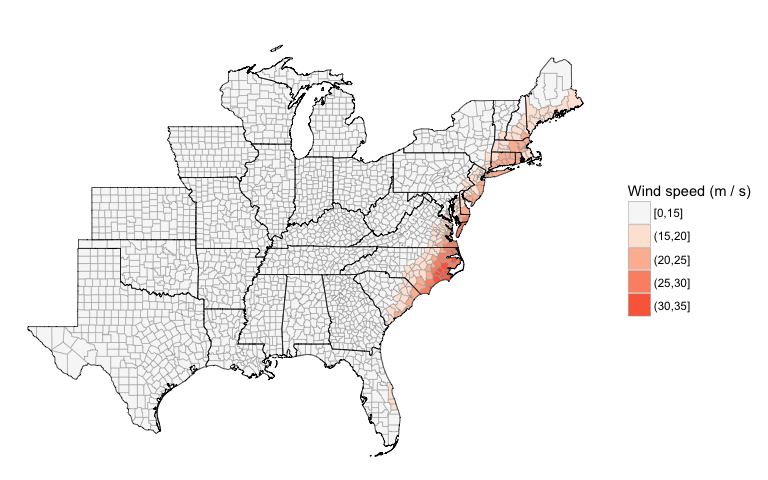

<!-- README.md is generated from README.Rmd. Please edit that file -->
Overview
--------

You can use the `stormwindmodel` package to model wind speeds at grid points in the United States based on "best tracks" hurricane tracking data.

This package is currently in development on GitHub. You can install it using (you will need to install `devtools` if you do not already have it):

``` r
devtools::install_github("geanders/stormwindmodel", build_vignettes = TRUE)
```

The package includes data on the tracks of Hurricane Floyd in 1999 and Hurricane Katrina in 2005. You can load this example best tracks data using:

``` r
library(stormwindmodel)
data("floyd_tracks")
head(floyd_tracks)
#> # A tibble: 6 × 4
#>           date latitude longitude  wind
#>          <chr>    <dbl>     <dbl> <dbl>
#> 1 199909071800     14.6     -45.6    25
#> 2 199909080000     15.0     -46.9    30
#> 3 199909080600     15.3     -48.2    35
#> 4 199909081200     15.8     -49.6    40
#> 5 199909081800     16.3     -51.1    45
#> 6 199909090000     16.7     -52.6    45
```

``` r
data("katrina_tracks")
head(katrina_tracks)
#> # A tibble: 6 × 4
#>           date latitude longitude  wind
#>          <chr>    <dbl>     <dbl> <dbl>
#> 1 200508231800     23.1     -75.1    30
#> 2 200508240000     23.4     -75.7    30
#> 3 200508240600     23.8     -76.2    30
#> 4 200508241200     24.5     -76.5    35
#> 5 200508241800     25.4     -76.9    40
#> 6 200508250000     26.0     -77.7    45
```

This example data includes the following columns:

-   `date`: Date and time of the observation (in UTC)
-   `latitude`, `longitude`: Location of the storm at that time
-   `wind`: Maximum wind speed at that time (knots)

You must have your storm tracks in this format and with these columns names to input the tracks to the functions in `stormwindmodel`. If necessary, use `rename` from `dplyr` to rename columns and `convert_wind_speed` from `weathermetrics` to convert windspeed into knots.

The `stormwindmodel` package also includes a dataset with the location of the population mean center of each U.S. county (`county_points`). This dataset can be used as the grid point inputs if you want to model storm-related winds for counties. These counties are listed FIPS number. The population for \[year\] is also included. This dataset comes from the US Census \[website\].

``` r
data(county_points)
head(county_points)
#>   gridid     glat      glon
#> 1  01001 32.50039 -86.49416
#> 2  01003 30.54892 -87.76238
#> 3  01005 31.84404 -85.31004
#> 4  01007 33.03092 -87.12766
#> 5  01009 33.95524 -86.59149
#> 6  01011 32.11633 -85.70119
```

This package uses the wind model developed by Willoughby et al. (2006) for modeling wind speed at each grid location. Full details on how this model is fit are provided in the "Details" vignetted of the `stormwindmodel` package.

Basic example
-------------

The main function of this package is `get_grid_winds`. It inputs storm tracks for a tropical cyclone and a dataframe with grid point locations and outputs summaries of wind at each grid point from the storm. The wind measurements generated for each grid point are:

-   `vmax_gust`: Maximum 10-m 1-minute gust wind experienced at the grid point during the storm
-   `vmax_sust`: Maximum 10-m 1-minute sustained wind experienced at the grid point during the storm
-   `gust_dur`: Duration gust wind was at or above a specified speed (default is 20 m/s) in minutes
-   `sust_dur`: Duration sustained wind was at or above a specified speed (default is 20 m/s) in minutes

To get modeled winds for Hurricane Floyd at U.S. county centers, you can run:

``` r
floyd_winds <- get_grid_winds(hurr_track = floyd_tracks,
                              grid_df = county_points)
floyd_winds %>%
  dplyr::select(gridid, vmax_gust, vmax_sust, gust_dur, sust_dur) %>%
  slice(1:6)
#>   gridid vmax_gust vmax_sust gust_dur sust_dur
#> 1  01001  2.925477  1.963407        0        0
#> 2  01003  1.882450  1.263389        0        0
#> 3  01005  4.698540  3.153383        0        0
#> 4  01007  2.292937  1.538884        0        0
#> 5  01009  2.612183  1.753143        0        0
#> 6  01011  3.997474  2.682868        0        0
```

If you model winds for county centers, so the `gridid` is a county FIPS, the `stormwindmodel` package has a function called `map_wind` for mapping the estimated winds. By default, it maps the maximum sustained wind in each county during the storm in meters per second.

``` r
map_wind(floyd_winds)
```



Further functionality
---------------------

There are a number of options when mapping wind speeds using `map_wind`.

First, you can use the `map_storm_track` function to add the storm track to the map:

``` r
floyd_map <- map_wind(floyd_winds)
add_storm_track(floyd_tracks, plot_object = floyd_map)
```


You can also choose whether to map sustained or gust winds, as well as the unit to use for wind speed.

``` r
map_wind(floyd_winds, value = "vmax_gust", wind_metric = "knots")
```


Finally, you can map a binary classification of counties with winds at or above a certain break point. For example, to map counties with sustained wind at or above 34 knots during the storm, you can run:

``` r
map_wind(floyd_winds, value = "vmax_sust", wind_metric = "knots",
         break_point = 34)
```


Tracks data
-----------

You can get an R version of best tracks data for Atlantic basin storms from 1988 to 2015 through the `hurricaneexposuredata` package (also in development on GitHub):

``` r
devtools::install_github("geanders/hurricaneexposuredata")
```

Here are all the storms included in that dataset:

``` r
library(hurricaneexposuredata)
data("hurr_tracks")
hurr_tracks %>% 
  tidyr::separate(storm_id, c("storm", "year")) %>%
  dplyr::select(storm, year) %>%
  dplyr::distinct() %>%
  dplyr::group_by(year) %>% 
  dplyr::summarize(storms = paste(storm, collapse = ", ")) %>% 
  knitr::kable()
```

| year | storms                                                                      |
|:-----|:----------------------------------------------------------------------------|
| 1988 | Alberto, Beryl, Chris, Florence, Gilbert, Keith                             |
| 1989 | Allison, Chantal, Hugo, Jerry                                               |
| 1990 | Bertha, Marco                                                               |
| 1991 | Ana, Bob, Fabian, Notnamed                                                  |
| 1992 | Andrew, Danielle, Earl                                                      |
| 1993 | Arlene, Emily                                                               |
| 1994 | Alberto, Beryl, Gordon                                                      |
| 1995 | Allison, Dean, Erin, Gabrielle, Jerry, Opal                                 |
| 1996 | Arthur, Bertha, Edouard, Fran, Josephine                                    |
| 1997 | Subtrop, Ana, Danny                                                         |
| 1998 | Bonnie, Charley, Earl, Frances, Georges, Hermine, Mitch                     |
| 1999 | Bret, Dennis, Floyd, Harvey, Irene                                          |
| 2000 | Beryl, Gordon, Helene, Leslie                                               |
| 2001 | Allison, Barry, Gabrielle, Karen, Michelle                                  |
| 2002 | Arthur, Bertha, Cristobal, Edouard, Fay, Gustav, Hanna, Isidore, Kyle, Lili |
| 2003 | Bill, Claudette, Erika, Grace, Henri, Isabel                                |
| 2004 | Alex, Bonnie, Charley, Frances, Gaston, Hermine, Ivan, Jeanne, Matthew      |
| 2005 | Arlene, Cindy, Dennis, Emily, Katrina, Ophelia, Rita, Tammy, Wilma          |
| 2006 | Alberto, Beryl, Chris, Ernesto                                              |
| 2007 | Andrea, Barry, Erin, Gabrielle, Humberto, Noel                              |
| 2008 | Cristobal, Dolly, Edouard, Fay, Gustav, Hanna, Ike, Kyle, Paloma            |
| 2009 | Claudette, Ida                                                              |
| 2010 | Alex, Bonnie, Earl, Hermine, Nicole, Paula                                  |
| 2011 | Bret, Don, Emily, Irene, Lee                                                |
| 2012 | Alberto, Beryl, Debby, Isaac, Sandy                                         |
| 2013 | Andrea, Dorian, Karen                                                       |
| 2014 | Arthur                                                                      |
| 2015 | Ana, Bill, Claudette                                                        |

References
==========

Willoughby, HE, RWR Darling, and ME Rahn. 2006. “Parametric Representation of the Primary Hurricane Vortex. Part II: A New Family of Sectionally Continuous Profiles.” *Monthly Weather Review* 134 (4): 1102–20.
