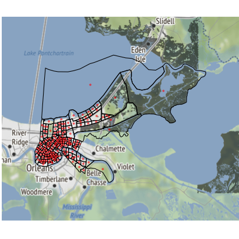
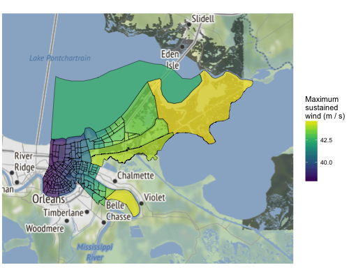

```{r message = FALSE, echo = FALSE}
library(dplyr)
```

## Overview

The `stormwindmodel` package was created to allow users to model wind speeds at grid points in the United States based on "best tracks" hurricane tracking data, using a model for wind speed developed by Willoughby and coauthors [-@willoughby2006parametric]. The package includes functions for interpolating hurricane tracks and for modeling and mapping wind speeds during the storm. It includes population mean center locations for all U.S. counties, which can be used to map winds by county; however, other grid point locations can also be input for modeling. Full details on how this model is fit are provided in the "Details" vignette of the `stormwindmodel` package.

## Package example data

For examples, the package includes data on the tracks of Hurricane Floyd in 1999 and Hurricane Katrina in 2005. You can load these example best tracks data sets using: 

```{r}
library(stormwindmodel)
data("floyd_tracks")
head(floyd_tracks)
data("katrina_tracks")
head(katrina_tracks)
```

This example data includes the following columns: 

- `date`: Date and time of the observation (in UTC)
- `latitude`, `longitude`: Location of the storm at that time
- `wind`: Maximum wind speed at that time (knots)

You can input other storm tracks into the wind modeling functions in the `stormwindmodel` package, but you must have your storm tracks in the same format as these example dataframes and with these columns names. If necessary, use `rename` from `dplyr` to rename columns and `convert_wind_speed` from `weathermetrics` to convert windspeed into knots.

The `stormwindmodel` package also includes a dataset with the location of the population mean center of each county in the eastern United States (`county_points`). This dataset can be used as the grid point inputs if you want to model storm-related winds for counties. These counties are listed by Federal Information Processing Standard (FIPS) number, which uniquely identifies each U.S. county. This dataset comes from the US Census [file of county population mean center locations](http://www2.census.gov/geo/docs/reference/cenpop2010/county/CenPop2010_Mean_CO.txt), as of the 2010 Census.

```{r}
data(county_points)
head(county_points)
```

You can use a different dataset of grid points to model winds at other U.S. locations, including at evenly-spaced grid points. However, you will need to include these grid points in a dataframe with a similar format to the example `county_points` dataframe, with columns for each grid point id (`gridid`--- these IDs can be random but should be unique across grid points), and `glat` and `glon` for latitude and longitude of each grid point.

## Basic example

The main function of this package is `get_grid_winds`. It inputs storm tracks for a tropical cyclone (`hurr_track`) and a dataframe with grid point locations (`grid_df`). It models winds during the tropical storm at each grid point and outputs summaries of wind during the storm at each grid point from the storm. The wind measurements generated for each grid point are: 

- `vmax_gust`: Maximum 10-m 1-minute gust wind experienced at the grid point during the storm
- `vmax_sust`: Maximum 10-m 1-minute sustained wind experienced at the grid point during the storm
- `gust_dur`: Duration gust wind was at or above a specified speed (default is 20 m/s), in minutes
- `sust_dur`: Duration sustained wind was at or above a specified speed (default is 20 m/s), in minutes

This function can take a few minutes to run, especially if you are modeling winds at many locations.

To get modeled winds for Hurricane Floyd at U.S. county centers, you can run: 

```{r eval = FALSE, echo = c(1)}
floyd_winds <- get_grid_winds(hurr_track = floyd_tracks, grid_df = county_points)
save(floyd_winds, file = "data/floyd_winds.Rdata")
```
```{r echo = c(2:4)}
load("data/floyd_winds.Rdata")
floyd_winds %>%
  dplyr::select(gridid, vmax_gust, vmax_sust, gust_dur, sust_dur) %>%
  slice(1:6)
```

If you use the `county_points` data for the `grid_df` argument, you will model winds for eastern U.S. county centers. In this case, the `gridid` is the county FIPS. If you model winds at U.S. county centers, you can map the results using the `map_wind` function. By default, this function maps the maximum sustained wind in each county during the storm in meters per second: 

```{r fig.width = 8}
map_wind(floyd_winds)
```

## Further functionality

### Options for modeling winds

You can input the track for any Atlantic Basin tropical storm into `get_grid_winds`, as long as you convert it to meet the following format requirements: 

- Is a dataframe of class `tbl_df` (you can use the `tbl_df` function from `dplyr` to do this)
- Has the following columns: 
    + `date`: A character vector with date and time (in UTC), expressed as YYYYMMDDHHMM. 
    + `latitude`: A numeric vector with latitude in decimal degrees.
    + `longitude`: A numeric vector with longitude in decimal degrees.
    + `wind`: A numeric vector with maximum storm wind speed in knots

For the grid point locations at which to model, you can input a dataframe with grid points anywhere in the eastern half of the United States. For example, you may want to map wind speeds for Hurricane Katrina by census tract in Orleans Parish, LA. The following code shows how a user could do that with the `stormwindmodel` package. 

First, the `tigris` package can be used to pull US Census tract shapefiles for a county. You can use the following code to pull these census tract file shapefiles for Orleans Parish in Louisiana: 

```{r message = FALSE, warning = FALSE}
library(tigris)
new_orleans <- tracts(state = "LA", county = c("Orleans")) 
```

This shapefile gives the polygon for each census tract. You can use the `gCentroid` function from the `rgeos` package to determine the location of the center of each census tract: 

```{r message = FALSE}
library(rgeos)
new_orleans_tract_centers <- gCentroid(new_orleans, byid = TRUE)@coords
head(new_orleans_tract_centers)
```

With some cleaning, you can get this data to the format required for the `get_grid_winds` function. In particular, you should add the tract id from the original shapefiles as the grid id, as this will help you map the modeled wind results: 

```{r}
new_orleans_tract_centers <- new_orleans_tract_centers %>%
  tbl_df() %>%
  mutate(gridid = unique(new_orleans@data$TRACTCE)) %>%
  rename(glat = y, 
         glon = x)
head(new_orleans_tract_centers)
```

Here is a map of the census tracts, with the center point of each shown with a red dot (note that an area over water is also included-- this is included as one of the census tract shapefiles pulled by `tigris` for Orleans Parish):

```{r message = FALSE, warning = FALSE}
library(ggplot2)
library(ggmap)
library(sp)

new_orleans_bbox <- bbox(new_orleans)
```

```{r message = FALSE, warning = FALSE, fig.width = 6, fig.height = 6, eval = FALSE, echo = c(2:10)}
png(filename = "figures/new_orleans1.png", height = 400, width = 400)
get_map(location = new_orleans_bbox + c(-0.1, -0.1, 0.1, 0.1), source = "stamen") %>%
  ggmap() + 
  geom_polygon(data = fortify(new_orleans), 
               aes(x = long, y = lat, group = group), 
               color = "black", fill = NA) + 
  theme_void() + 
  geom_point(data = new_orleans_tract_centers,
             aes(x = glon, y = glat, group = NULL), 
             color = "red", size = 1, alpha = 0.5)
dev.off()
```

```{r echo = FALSE, fig.width = 6, fig.height = 6}

```

(As a note, to get this code to work correctly yourself, you may need to install the development version of the `ggmap` package from GitHub. You can do that with the command `devtools::install_github("dkahle/ggmap")`. You will need to have the `devtools` package installed on your computer.)

Since the `new_orleans_tract_centers` is now in the appropriate format, you can input it directly into `get_grid_winds` to model the winds from Hurricane Katrina at each census tract center: 

```{r eval = FALSE, echo = c(1:2)}
new_orleans_tracts_katrina <- get_grid_winds(hurr_track = katrina_tracks, 
                                             grid_df = new_orleans_tract_centers)
save(new_orleans_tracts_katrina, file = "data/new_orleans.Rdata")
```
```{r echo = c(2)}
load("data/new_orleans.Rdata")
head(new_orleans_tracts_katrina)
```

To plot these modeled winds, you can merge this modeled data back into a "fortified" version of the census tract shapefile data, joining by census tract identification, and then add to the map. You can showwind speed in this map with color.

```{r message = FALSE, message = FALSE, warning = FALSE, fig.width = 7, fig.height = 6}
library(viridis)

new_orleans <- new_orleans %>% 
  fortify(region = "TRACTCE") %>%
  left_join(new_orleans_tracts_katrina, by = c("id" = "gridid"))
```
```{r eval = FALSE, echo = c(2:9)}
png("figures/new_orleans2.png", height = 400, width = 500)
get_map(location = new_orleans_bbox + c(-0.1, -0.1, 0.1, 0.1), source = "stamen") %>%
  ggmap() + 
  geom_polygon(data = new_orleans, 
               aes(x = long, y = lat, group = group,
                   fill = vmax_sust), 
               color = "black", alpha = 0.7, size = 0.2) + 
  scale_fill_viridis(name = "Maximum\nsustained\nwind (m / s)") + 
  theme_void() 
dev.off()
```
```{r echo = FALSE, fig.width= 7, fig.height = 5}

```


There are also functions in this package that you can use to create a time series of all modeled winds at a specific grid point throughout the storm. For example, here is the code to calculate modeled wind at the population mean center of Dare County, NC (FIPS: 37055) throughout Hurricane Floyd: 

```{r warning = FALSE, message = FALSE, fig.width = 6, fig.height = 2.5}
dare_county <- county_points %>% # Get grid point information for Dare County
  filter(gridid == "37055")

with_wind_radii <- floyd_tracks %>%
  create_full_track() %>% # Interpolate tracks to every 15 minutes
  add_wind_radii()        # Calculate required inputs for Willoughby wind model

dare_winds <- calc_grid_wind(grid_point = dare_county,          # Model winds at one grid point
                             with_wind_radii = with_wind_radii)

ggplot(dare_winds, aes(x = date, y = windspeed)) + 
  geom_line() + 
  xlab("Observation time (UTC)") + 
  ylab("Modeled surface wind (m / s)") 
```

For more details, see the "Details" vignette, which walks through all steps of the modeling process. 

### Options for mapping county-level winds

There are a number of options when mapping wind speeds using `map_wind`. 

First, you can use the `add_storm_track` function to add the storm track to the map. This function inputs one dataframe with tracking data (the `floyd_tracks` example data that comes with the package in this case) as well as the plot object created using `map_wind`, which is input using the `plot_object` argument. In this example code, we've first created the base map of modeled winds in each county using `map_wind`. We then input that, along with Floyd's track data, into `add_storm_track` to create a map with both winds and the storm tracks:

```{r fig.width = 8}
floyd_map <- map_wind(floyd_winds)
add_storm_track(floyd_tracks, plot_object = floyd_map)
```

You can choose whether to map sustained or gust winds (`value`, which can take "vmax_gust" or "vmax_sust"), as well as the unit to use for wind speed (`wind_metric`, which can take values of "mps" for meters per second [the default] or "knots"). For example, you can modeled gust wind speeds in knots during Hurricane Floyd using:

```{r fig.width = 8}
map_wind(floyd_winds, value = "vmax_gust", wind_metric = "knots")
```

Finally, you can map a binary classification of counties with winds at or above a certain break point. For example, to map counties with sustained wind at or above 34 knots during Hurricane Floyd, you can run: 

```{r fig.width = 8}
map_wind(floyd_winds, value = "vmax_sust", wind_metric = "knots", break_point = 34)
```

## Tracks data

You can get an R version of the hurricane best tracks data for Atlantic basin storms from 1988 to 2015 through the `hurricaneexposuredata` package (in development on GitHub). For more information, see [the GitHub repository for that package](https://github.com/geanders/hurricaneexposuredata).

# References
 
